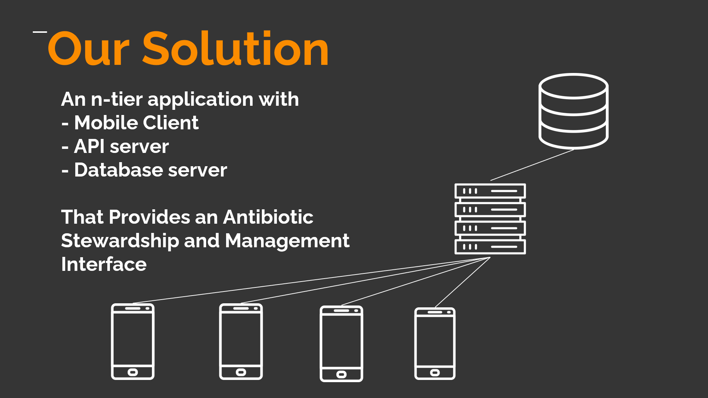

# Smart India Hackathon 2020

* **Problem Statement:** Antimicrobial Stewardship Platform

* **Our Solution:** A real time mobile application that will help the user to monitor his antibiotic consumption and management, resulting as an ANtibicrobial Stewardship Platform

**Team Name:** Dark Shadows

**Problem Statement Owner:** Amazon Web Services

**Domain:** Healthcare and Biomedical Devices

#### Team Members:

Chandra Kanth Garalapati (Team Lead),
Mehanth Kammakomati,
Mallijeddi Venkatesh,
Manjunatha Kapil ,
Kommidi Mani Kiran Reddy,
Janhavi Sonnatkar.

National Insitute of Technology, Tadepalligudem, Andhra Pradesh.

## **ABSTRACT**

We provided an simple, user interactive, scalable and end-to-end solution for providing the user an interface to manage his antibiotic consumption and also help to manage it.

The data collected will be used by the Government for calculating some National Stats.

### **Different Component in the project:**

* [UI Design](./docs/UIdesigns.md)

**Description:** Our UI design cosnsists the following componenets
* [Sign In:](./docs/assets/SignIn.png)
    * For User Sign in to the app
* [Register:](./docs/assets/Register.png)
    * For new Users to register
* [Dashboard:](./docs/assets/Dashboard.png)
    * The Dynamic Dashboard where usr can manage his antibiotic consumption
* [FAQ:](./docs/assets/FAQ.png)
    * To solve users frequently answered questions
* [Input System:](./docs/assets/InputSystem.png)
    * To collect user data to help him manage
* [Information Spectrum:]
    * Helps the user to educate and verify any information regarding any antibiotic
* [News Section:](./docs/assets/News.png)
    * a Dymanic section to make our users be updated with latest news regarding the Antibiotics, Pathogens and Diseases
* [Settings:](./docs/assets/Settings.png)
    * For the General App Functions

*Please move to the [UIDesign](./docs/UIdesigns.md) to even check the mockup design images*

* [Project Architecture](./docs/Project_Architecture.md)

**Description:** This explains the following components of the App
* [The Technical Stack Used](./docs/assets/TechnicalStack.png)
* [The Funtions](./docs/assets/Functions.png)
* [Use Case Diagram](./docs/assets/UsecaseDiagram.png)

* [API Server Endpoints](./docs/APIdesign.md)

**Description:** To know about the Entire API Server Endpoints used

* [High Level Database Schema](./docs/HighLevelDB.md)
**Description:** This shows the high level idea of our database schema

You can click on the respective Links to refer to respective docs or Images