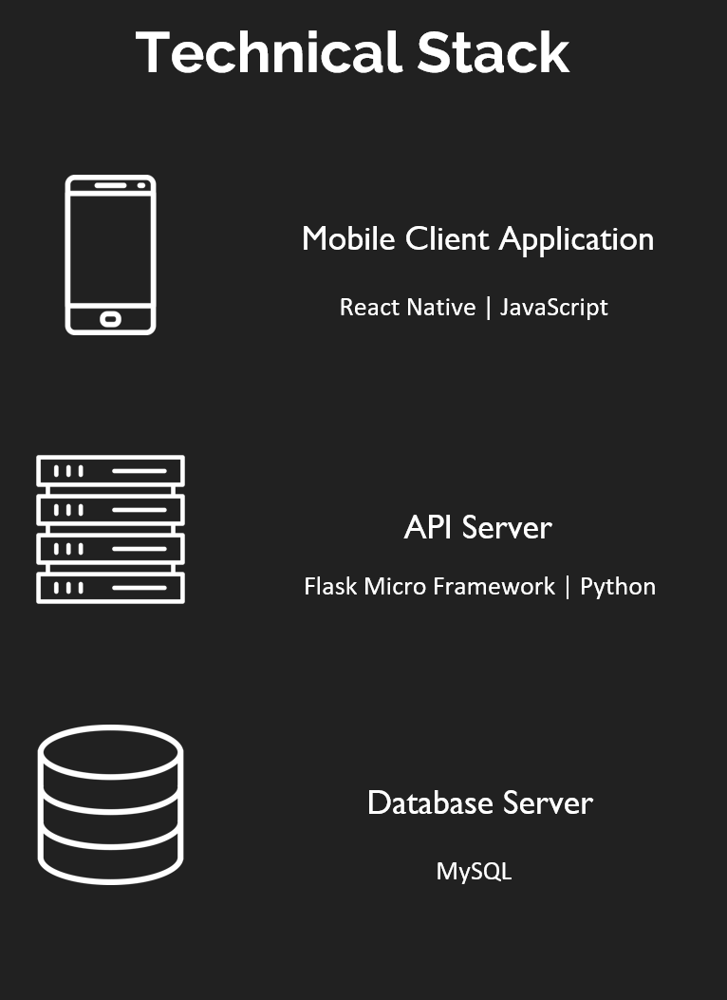
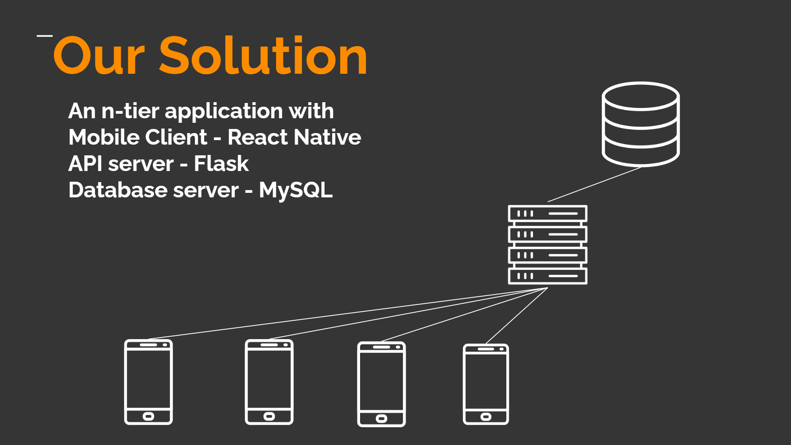
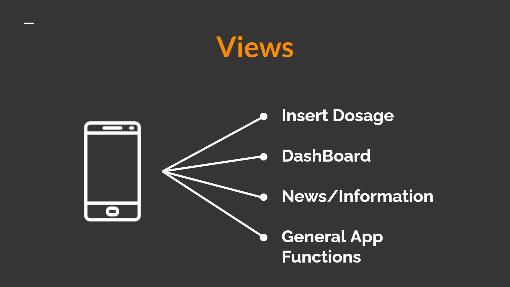
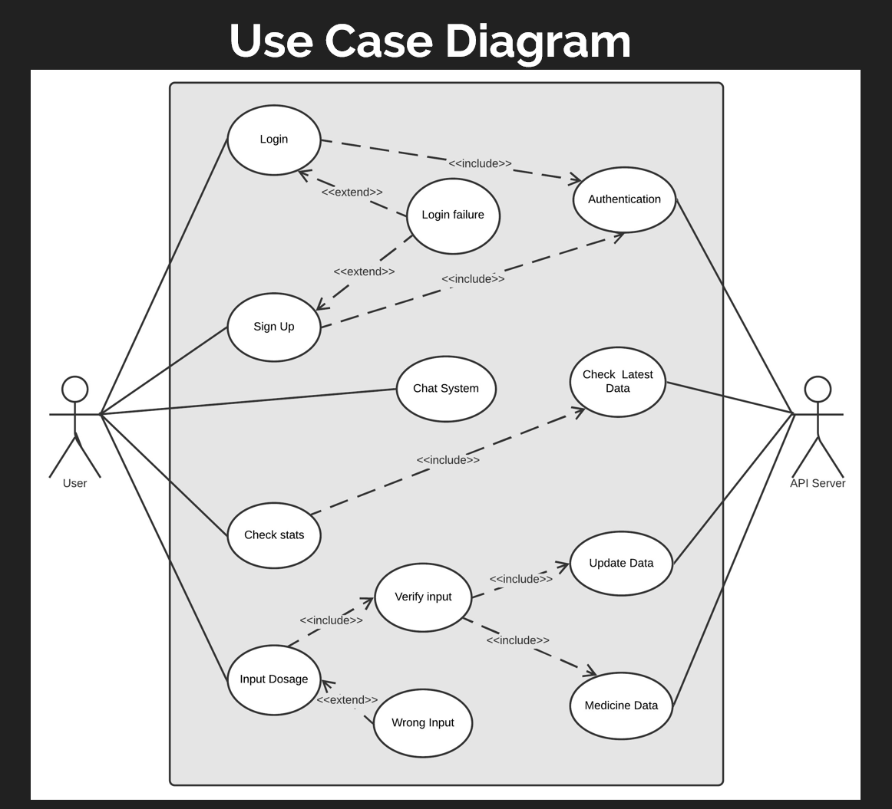

# Project Architecture:

**Description:** The project architecture is as follows

## Technical Stack:

**Description:** 
* **Frontend:** We have used React Native and JavaScript for the UI.
* **API SErver:** We have used Flask as the API server.
* **Backend:** We have used MySQL as our Database server as this is more relavent to our data structure.

## Architecture of the Project:

**Description:** The project Architecture is as above.

## Functions Used:

**Dsscription:** The functions used in our Project.

## Use Case Diagram:

**Description:** The in-app workflow will be as above.