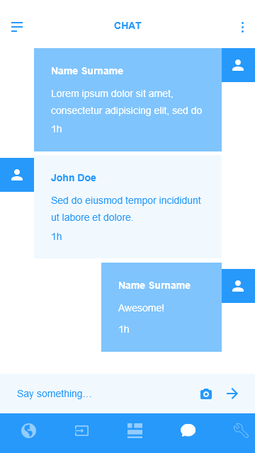

# UI Design:

**Description:** This is a mockup design for our app.
Our developers will be replicating the above design in this project.

## Sign In Page:

**Description:** A beautiful Sign In page for the users you have accounts

## Register Page:

**Description:** And for the new users to register

## Chat:

 **Description:** Then the Chat Room, this is a communication platform where the users can interact with the available stewards to have a discussion on antibiotic usage and can also have exposure to antibiotics.

## Input System:

**Description:** This is a user intake system can be used to collect the data from the users on their antibiotic usage and help them to keep track of antibiotic consumption and also notify them incase of any danger or prone to some antimicrobial infection

## Dashboard:

**Description:** A dynamic dashboard contains the national and individual user stats based on the antibiotic usage

## News:

**Description:** A dynamic section help the users to educate themselves with the latest news and facts on antibiotics and thier usage

## Settings:

**Description:** The General App functions page