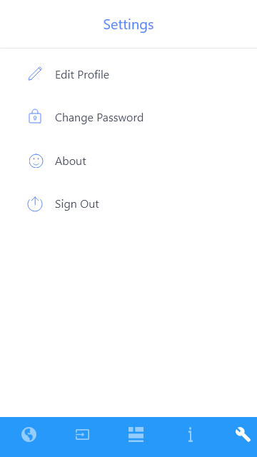

# UI Design:

**Description:** This is a mockup design for our app.
Our developers will be replicating the above design in this project.

## Sign In Page:

**Description:** A beautiful Sign In page for the users you have accounts.

## Register Page:

**Description:** And for the new users to register.

## FAQ's:

 **Description:** To solve most of the user's frequent queries, porivde the solution to it with the FAQ section and help to clear there doubts in an instant.

## Input System:

**Description:** This is a user intake system can be used to collect the data from the users on their antibiotic usage and help them to keep track of antibiotic consumption and also notify them incase of any danger or prone to some antimicrobial infection.

## Dashboard:

**Description:** A dynamic dashboard contains the national and individual user stats based on the antibiotic usage that help the user to monitor his antibiotic consumption and also maintain it.

## News or Information Spectrum:

**Description:** A dynamic section help the users to educate themselves with the latest news and facts on antibiotics and their usage.

## Settings:

**Description:** The General App functions page